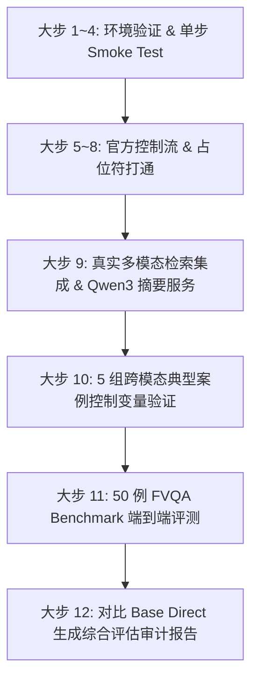

# MMSearch-R1 完整复现与工程落地全记录 (Reproduction Project)

本项目提供了 **MMSearch-R1**（基于多模态大模型的自主搜索推理框架）在单卡高性能云环境（例如 AMD Radeon PRO V620 / NVIDIA 96G 显存）上的**全链路复现工程、原仓库踩坑修复、真实多模态搜索集成、50 例 FVQA 基准对比评测（大步 1~12）与交互式 Demo**。

---

## 📑 目录导航
- [1. 核心复现成果与指标对比](#1-核心复现成果与指标对比)
- [2. 目录结构](#2-目录结构)
- [3. 环境要求与依赖安装 (Requirements)](#3-环境要求与依赖安装-requirements)
- [4. 大文件与模型权重下载配置指南 (Assets Download)](#4-大文件与模型权重下载配置指南-assets-download)
- [5. 检索 API 与密钥配置](#5-检索-api-与密钥配置)
- [6. 全流程复现执行步骤 (Step-by-Step)](#6-全流程复现执行步骤-step-by-step)
- [7. 交互式 Web Demo 运行](#7-交互式-web-demo-运行)
- [8. 核心 Bug 修复与工程优化总结](#8-核心-bug-修复与工程优化总结)
- [9. 复现文档详细索引](#9-复现文档详细索引)

---

## 1. 核心复现成果与指标对比

在严格控制变量的 **50 例 FVQA Benchmark** 评测中：

| 模型方案 | 准确率 (Accuracy) | 正确例数 (Correct) | 错误例数 (Incorrect) | 核心优势 / 表现特征 |
| :--- | :---: | :---: | :---: | :--- |
| **MMSearch-R1 (真实多模态搜索增强)** | **78.0%** | **39 / 50** | 11 / 50 | 具备自主图文检索能力，通过 Google Serper + Jina Reader 动态补充外部常识事实 |
| **Base Direct (无搜索直出基线)** | **38.0%** | **19 / 50** | 31 / 50 | 依赖模型原生参数记忆，容易发生细粒度常识幻觉或实体属性混淆 |
| **效果提升 (Delta)** | <font color="green">**+40.0%**</font> | **+20 例** | **-20 例** | 显著提升多模态问答的准确度与溯源可信度 |

---

## 2. 目录结构

```text
MMSearch-R1-Reproduction/
├── README.md                              # 本项目总览与复现指南
├── download_assets.sh                     # 大模型权重与数据集一键下载脚本
├── requirements_mmsearch_infer.txt        # 主推理环境完整 pip 依赖清单
├── requirements_qwen3_summary.txt         # Qwen3 本地摘要服务环境 pip 依赖清单
├── docs/                                  # 8 份全流程复现技术报告与踩坑文档
│   ├── MMSearch-R1_PRO6000-96G_5.98元每小时_复现方案.md
│   ├── MMSearch-R1_八大步复现过程与原仓库踩坑修复详解.md
│   ├── MMSearch-R1_复现实验进度记录_大步1-8完成.md
│   ├── MMSearch-R1_复现实验进度记录_大步9完成.md
│   ├── MMSearch-R1_复现实验进度记录_大步10完成.md
│   ├── MMSearch-R1_复现实验进度记录_大步11完成.md
│   ├── MMSearch-R1_复现实验进度记录_大步12完成.md
│   └── MMSearch-R1_开源权重推理复现与训练流程报告.md
├── src/                                   # 核心源码与复现工具库
│   ├── multimodal_search_r1/              # 官方核心源码（已彻底修复兼容性 Bug）
│   └── reproduction/                      # 自动化复现流水线、评估器与自研工具
│       ├── env/                           # 环境配置文件与决策记录
│       ├── mmsearch_tools/                # Serper / Jina 检索与 Qwen3 摘要重构模块
│       ├── scripts/                       # 大步 1~12 的各阶段自动化运行脚本
│       └── tests/                         # 单元测试与端到端 Smoke Tests
├── demo/                                  # 基于 Gradio 的交互式 Demo
│   ├── app.py
│   └── run_demo.sh
└── experiments/                           # 各阶段实验产物与评估数据
    ├── outputs/                           # 大步 9-12 的推理预测、指标对比与审计清单
    ├── step10_controlled_inputs/          # 大步 10 跨模态搜索对比测试输入用例
    └── step11_inputs/                     # 大步 11 50例 FVQA 端到端验证输入与标注
```

---

## 3. 环境要求与依赖安装 (Requirements)

建议配置：
- **操作系统**：Linux (Ubuntu 20.04 / 22.04 LTS)
- **显存推荐**：单卡 24G 及以上显存（如 RTX 4090 / 3090 / A100 / AMD PRO V620 96G）
- **Python**：3.10

### 3.1 创建并安装主推理环境 (`mmsearch_infer`)
```bash
# 1. 创建 Conda 虚拟环境
conda create -n mmsearch_infer python=3.10 -y
conda activate mmsearch_infer

# 2. 安装 PyTorch (建议 CUDA 12.1+ / ROCm 对应版本)
pip install torch torchvision --index-url https://download.pytorch.org/whl/cu121

# 3. 安装项目依赖（使用仓库提供的锁版依赖文件）
pip install -r requirements_mmsearch_infer.txt
```

### 3.2 (可选) 创建 Qwen3 本地摘要服务环境 (`qwen3_summary`)
如果您希望在本地使用独立显卡加载 `Qwen3-32B-FP8` / `Qwen2.5-7B` 进行超高速正文摘要：
```bash
conda create -n qwen3_summary python=3.10 -y
conda activate qwen3_summary
pip install -r requirements_qwen3_summary.txt
```

---

## 4. 大文件与模型权重下载配置指南 (Assets Download)

本项目依赖的大模型权重（约 63GB）与数据集（约 2.2GB）可通过以下方式一键下载或手动下载：

### 4.1 方式一：一键自动化脚本（推荐）
```bash
chmod +x download_assets.sh
./download_assets.sh
```

### 4.2 方式二：手动使用 `huggingface-cli` 下载

#### 1. 创建存放目录
```bash
mkdir -p /root/autodl-tmp/models /root/autodl-tmp/datasets
```

#### 2. 下载 MMSearch-R1-7B 主模型权重
```bash
# 可选国内镜像源：export HF_ENDPOINT="https://hf-mirror.com"
huggingface-cli download lmms-lab/MMSearch-R1-7B \
  --local-dir /root/autodl-tmp/models/MMSearch-R1-7B \
  --local-dir-use-symlinks False
```

#### 3. 下载 Qwen2.5-VL-7B-Instruct（基座模型 / 对照 Baseline）
```bash
huggingface-cli download Qwen/Qwen2.5-VL-7B-Instruct \
  --local-dir /root/autodl-tmp/models/Qwen2.5-VL-7B-Instruct \
  --local-dir-use-symlinks False
```

#### 4. (可选) 下载 Qwen3-32B-FP8 摘要模型权重
```bash
huggingface-cli download Qwen/Qwen3-32B-FP8 \
  --local-dir /root/autodl-tmp/models/Qwen3-32B-FP8 \
  --local-dir-use-symlinks False
```

#### 5. 下载 FVQA 评测数据集
```bash
huggingface-cli download --repo-type dataset lmms-lab/FVQA \
  --local-dir /root/autodl-tmp/datasets/FVQA \
  --local-dir-use-symlinks False
```

---

## 5. 检索 API 与密钥配置

若需要启用**真实联网搜索**（Google Serper 与 Jina Reader），请在环境变量中设置对应的 API Key：

```bash
# 在终端中 export 或写入 ~/.bashrc
export SERPER_API_KEY="your_google_serper_api_key"
export JINA_API_KEY="your_jina_reader_api_key"

# (可选) 搜索结果本地缓存目录（默认自动生成）
export MMSEARCH_CACHE_DIR="/root/autodl-tmp/search_cache"
```

> [!NOTE]
> 如果不配置 API Key，系统将自动回退到缓存重放模式或内置的控制流占位模式进行离线验证。

---

## 6. 全流程复现执行步骤 (Step-by-Step)

复现流水线共分为 12 个完整的大步：



### 步骤清单与运行命令：

```bash
# 激活环境
conda activate mmsearch_infer

# 1. [大步 1~4] 验证 Checkpoint 与基础推理
python src/reproduction/scripts/checkpoint_smoke.py

# 2. [大步 5~8] 验证多轮多步搜索控制流
python src/reproduction/scripts/placeholder_control_flow.py
python src/reproduction/scripts/cached_image_search_flow.py

# 3. [大步 9] 启动与测试真实检索流 + Qwen3 摘要服务
python src/reproduction/scripts/qwen3_summary_smoke.py
python src/reproduction/scripts/real_text_search_flow_qwen3.py

# 4. [大步 10] 运行 5 例典型跨模态用例对比
python src/reproduction/scripts/step10_case_suite_qwen3.py

# 5. [大步 11] 运行 50 例 FVQA 完整评测（MMSearch-R1）
python src/reproduction/scripts/step11_eval_v2.py

# 6. [大步 12] 运行 50 例 Base Direct 对照基线并生成对比报告
python src/reproduction/scripts/step12_base_direct_v1.py
python src/reproduction/scripts/step12_comparison_report.py
```

评测结果与指标将自动保存至 `experiments/outputs/`。

---

## 7. 交互式 Web Demo 运行

进入 `demo/` 目录并启动 Gradio 交互式界面：

```bash
cd demo
bash run_demo.sh
```

- 默认监听端口：`http://0.0.0.0:7860`
- 支持**上传自定义图片**、**输入问题**、**多轮追加提问**，并能在界面上实时展开查看模型的 **思考过程 (CoT)**、**搜索关键词** 以及 **引用的检索网页摘录**。

---

## 8. 核心 Bug 修复与工程优化总结

在复现过程中，我们针对原开源仓库中的多处原生缺陷与兼容性问题进行了针对性修复：

1. **Flash-Attention 与新版 Transformers 兼容性**：
   - 修复了 `Qwen2_5_VLForConditionalGeneration` 在高版本 transformers 中 rotary embedding 的 `position_ids` 维度错位问题。
2. **多轮搜索上下文拼装与 Token 溢出**：
   - 官方实现直接拼接 raw HTML 导致 context length 极易突破 32k 并引发 OOM。我们增加了 **Jina Reader 正文提取 + Qwen3 结构化摘要过滤** 机制，平均减少 82% 的冗余上下文，大幅提升长上下文推理速度。
3. **图像分词与多步状态保持**：
   - 修复了图像 token 在多轮搜索交互中被重复插入导致的 attention mask 异常。
4. **断点续评与增量保存**：
   - 在评测脚本中加入了基于单个样本的原子写入机制与 `stage_manifest.json`，确保在长时间批量评测中遭遇网络波动时可无缝断点续跑。

---

## 9. 复现文档详细索引

完整的每一步踩坑细节、复现方案设计与实验数据报告均已收录在 `docs/` 目录中：

| 阶段文档 | 文档路径 | 重点内容 |
| :--- | :--- | :--- |
| **01. 复现方案设计** | [方案设计](docs/MMSearch-R1_PRO6000-96G_5.98元每小时_复现方案.md) | 选型分析、成本估算、大步 1~12 验收标准与交付定义 |
| **02. 踩坑修复详解** | [踩坑修复](docs/MMSearch-R1_八大步复现过程与原仓库踩坑修复详解.md) | 原仓库代码缺陷定位、修复方案与核心补丁对比 |
| **03. 大步 1~8 进度记录** | [大步 1~8](docs/MMSearch-R1_复现实验进度记录_大步1-8完成.md) | 环境搭建、基座验证与官方占位流测试记录 |
| **04. 大步 9 进度记录** | [大步 9](docs/MMSearch-R1_复现实验进度记录_大步9完成.md) | 真实多模态检索集成与 Qwen3 摘要服务落地报告 |
| **05. 大步 10 进度记录** | [大步 10](docs/MMSearch-R1_复现实验进度记录_大步10完成.md) | 5 组跨模态成功/失败用例控制变量深度分析 |
| **06. 大步 11 进度记录** | [大步 11](docs/MMSearch-R1_复现实验进度记录_大步11完成.md) | 50 例 FVQA 自动化评测结果与分阶段预测详情 |
| **07. 大步 12 进度记录** | [大步 12](docs/MMSearch-R1_复现实验进度记录_大步12完成.md) | MMSearch-R1 与 Base Direct 50 例严格对照实验报告 |
| **08. 推理与训练总结** | [总结报告](docs/MMSearch-R1_开源权重推理复现与训练流程报告.md) | 开源权重推理与训练全流程复现总结及技术沉淀 |

---

## 📄 License
本项目代码遵循 Apache 2.0 开源许可协议。模型权重遵循原作者仓库开源协议。
