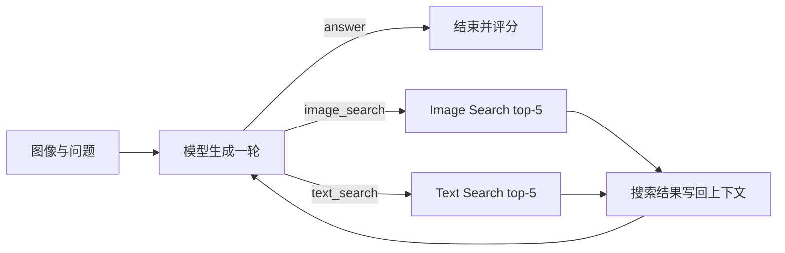
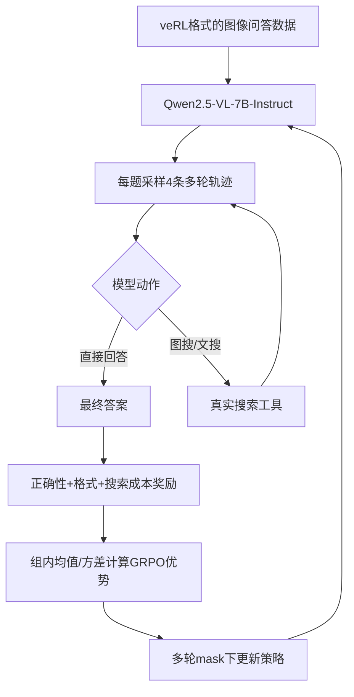
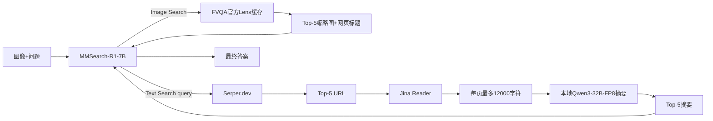

# MMSearch-R1：训练流程介绍、开源权重推理复现与样例展示报告

更新时间：2026-08-17 UTC

## 摘要

本报告围绕“介绍训练流程、根据开源权重跑通推理流程、使用官方数据或自行构造数据进行样例展示、讨论未来改进方向”四项基本要求，对 MMSearch-R1 进行复现和分析。

本次工作没有重新执行论文的 GRPO 大规模训练，而是依据官方代码分析其训练流程，并使用官方发布的 `lmms-lab/MMSearch-R1-7B` 开源权重完成推理与真实搜索工具链复现。实验使用官方 `lmms-lab/FVQA` 数据、官方 FVQA Image Search cache、Serper.dev 文本搜索、Jina Reader 网页读取，以及本地 `Qwen/Qwen3-32B-FP8` 网页摘要服务。在单张 NVIDIA RTX PRO 6000 Blackwell 96GB GPU 上，成功展示了 Search-Free、Image Search、Text Search 和 Mixed Search 四种工程路径，并在固定 50 条 FVQA 子集上进行了批量评测。

在相同 50 条样本和 strict Exact Match 指标下：

- `MMSearch-R1-7B` 自然按需搜索得到 20/50，Accuracy 为 40.0%；
- `Qwen2.5-VL-7B-Instruct` Base Direct Answer 得到 7/50，Accuracy 为 14.0%；
- MMSearch 相对 Base 提高 26.0 个百分点；
- MMSearch 共调用 70 次搜索，Search Ratio 为 70.0%；
- 提升主要来自 Search-Required 子集：Base 0.0%，MMSearch 44.0%。

因此，本项目已经满足基本任务要求，并额外完成了真实工具链、分阶段批量评测、Base 对照、失败分析和独立证据审计。需要强调：本报告属于开源权重推理与系统复现，不是论文完整训练复现，也不应将本次 50 条 FVQA train 子集结果等同于论文完整 benchmark。

---

## 1. 项目背景与任务目标

### 1.1 MMSearch-R1 解决的问题

传统多模态大模型通常只依赖输入图像和模型内部知识直接回答问题。当图像中的实体难以识别，或问题需要最新、长尾、外部事实时，模型容易产生幻觉或错误答案。

MMSearch-R1 将多模态问答建模为一个按需、多轮工具使用过程。模型每轮可以选择：

1. 直接回答；
2. 调用 Image Search，通过相似图片和网页标题识别视觉实体；
3. 调用 Text Search，通过网页检索获得外部事实；
4. 先 Image Search 识别实体，再 Text Search 获取相关知识，最后回答。

核心目标不是“每道题都搜索”，而是学习：

> 知道时直接回答，不知道时选择合适工具，并在获得搜索结果后继续推理。

### 1.2 本次完成范围

本次工作完成了：

- 根据官方代码介绍 GRPO 多轮搜索训练流程；
- 固定并校验官方 MMSearch-R1-7B 开源权重；
- 跑通 Search-Free 和 Search-Required 推理；
- 接入真实 Image Search、Text Search、Jina Reader 和 Qwen3 摘要；
- 展示四类搜索路径和一个失败案例；
- 在固定 50 条官方 FVQA 样本上进行批量评测；
- 与 Qwen2.5-VL-7B-Instruct Base 进行公平对比；
- 保存逐样本 trace、指标、环境、模型 revision 和独立审计结果。

本次未执行：

- 论文的完整 GRPO/veRL 训练；
- 100/300 条扩展评测；
- 完整 FVQA test benchmark；
- LLM-as-Judge；
- Blackwell 版旧训练栈迁移。

---

## 2. MMSearch-R1 训练流程介绍

本节根据本地官方仓库的 README、训练启动脚本、rollout、reward 和 actor 实现进行说明。以下是“官方代码定义的训练流程”，不代表本机重新执行了该训练。

### 2.1 训练基座与框架

官方训练脚本以 `Qwen/Qwen2.5-VL-7B-Instruct` 为基座，使用：

- veRL：强化学习训练框架；
- GRPO：Group Relative Policy Optimization；
- vLLM：并行生成多条多轮搜索轨迹；
- FSDP：分布式参数训练；
- 多轮 response mask：只对模型生成的 assistant token 计算策略损失。

官方入口：

```bash
bash mmsearch_r1/scripts/run_mmsearch_r1_grpo.sh
```

本地官方脚本的关键配置包括：

| 配置 | 值 | 含义 |
|---|---:|---|
| Base model | Qwen2.5-VL-7B-Instruct | 初始多模态模型 |
| `adv_estimator` | `grpo` | 使用 GRPO 优势估计 |
| Train batch size | 32 | 每个训练 batch 的问题数 |
| Rollout `n` | 4 | 每个问题采样 4 条候选轨迹 |
| Max rounds | 3 | 最多 3 轮模型生成 |
| Image Search limit | 1 | 每条轨迹最多一次图搜 |
| Text Search limit | 2 | 每条轨迹最多两次文搜 |
| Search top-k | 5 | 工具返回前 5 条结果 |
| Learning rate | `2e-6` | Actor 学习率 |
| KL coefficient | `0.001` | 约束策略偏离参考模型 |
| Epochs | 30 | 官方脚本配置训练轮数 |
| GPUs | 8 | 仓库单机脚本配置；论文正式训练资源更大 |

### 2.2 训练数据格式

训练和验证数据采用 veRL 所需的 Parquet 格式。核心字段包括：

- `prompt`：用户问题；
- `images`：输入图像；
- `reward_model.ground_truth`：标准答案；
- `reward_model.candidate_answers`：可接受的候选答案；
- `data_source`：数据来源；
- `image_urls`：供 Image Search 使用的图像地址或引用；
- `extra_info`：奖励与样本附加配置。

官方仓库提供 `mmsearch_r1/data/mini_data.pq` 作为格式示例，其中包含 5 条样本。例如一条样本的问题是 “What is the country of origin of this food?”；Ground Truth 为 `Spain`，候选答案还包含 `Kingdom of Spain`、`ESP`、`ES` 等别名。

### 2.3 多轮动作空间

模型输出使用结构化标签表达动作：

```text
直接回答：
<reason>...</reason><answer>...</answer>

图像搜索：
<reason>...</reason><search></search>

文本搜索：
<reason>...</reason><text_search>query</text_search>
```

因此最多三轮的合法路径包括：

```text
Image + Question → Answer
Image + Question → Image Search → Answer
Image + Question → Text Search → Answer
Image + Question → Image Search → Text Search → Answer
```

### 2.4 多轮 rollout

训练时，每个问题采样 4 条候选轨迹。每条轨迹按以下循环执行：



rollout 实现会：

- 检测回复末尾的 Image/Text Search 标签；
- 调用相应工具；
- 把搜索结果作为新的 user/tool 信息加入上下文；
- 在搜索次数和最大轮数限制内继续生成；
- 为 assistant token 标记 `1`，为用户输入和工具返回标记 `0`，形成 `multi_turn_response_mask`。

### 2.5 奖励函数

官方奖励由三部分共同决定：答案正确性、输出格式和搜索成本。

#### 正确性奖励

训练奖励先从最后一轮 `<answer>...</answer>` 中提取答案，再执行规范化 EM 或 SubEM。训练侧的规范化会：

- 转小写；
- 删除标点；
- 删除 `a/an/the`；
- 合并多余空白；
- 同时匹配 Ground Truth 和 candidate answers。

正确记为 1，错误记为 0。

#### 格式奖励

奖励函数检查整条轨迹是否属于合法结构，例如：

- 一轮直接回答；
- 图搜后回答；
- 文搜后回答；
- 图搜、文搜后回答。

格式合法记为 1，否则为 0。

#### 搜索成本

默认情况下，只有在答案已经正确时才对搜索进行惩罚，防止模型为了获得高分而无条件调用搜索。默认 search penalty 为 0.1，format penalty 为 0.1。

简化后的默认奖励可以写为：

```text
如果答案正确且调用了搜索：correctness ← correctness × 0.9

reward = 0.9 × correctness + 0.1 × format_score
```

这使模型同时学习：

- 回答正确；
- 输出合法工具标签；
- 不进行不必要的搜索。

### 2.6 GRPO 更新

对于同一个问题采样的 4 条轨迹，先得到每条轨迹的 outcome reward，然后计算组内相对优势：

```text
A_i = (R_i - mean(R_group)) / (std(R_group) + epsilon)
```

如果不启用标准差归一化，则只减组均值。该优势被广播到轨迹中的有效 assistant token，再通过 clipped policy objective 和 KL 约束更新 Actor。

多轮 response mask 非常关键：工具返回、用户消息和历史非模型 token 不应该被当作模型动作计算策略梯度。实现中最终使用：

```text
response_mask = attention_mask × multi_turn_response_mask
```

### 2.7 训练流程总结

完整训练流程可概括为：



---

## 3. 开源权重与实验环境

### 3.1 硬件

| 项目 | 配置 |
|---|---|
| GPU | NVIDIA RTX PRO 6000 Blackwell Server Edition |
| 显存 | 97,887 MiB |
| Compute Capability | 12.0 / `sm_120` |
| Driver | 595.58.03 |
| 主推理 PyTorch | 2.8.0+cu128 |
| 主推理 CUDA runtime | 12.8 |
| MMSearch dtype | BF16 |
| Attention | SDPA |

### 3.2 使用的开源权重

#### 主模型

```text
Repo: lmms-lab/MMSearch-R1-7B
Revision: 3cdec93e6db79a409aff4a4b2eadc77a5a8a1e46
Local: /root/autodl-tmp/models/MMSearch-R1-7B
Files: 17
Bytes: 16,600,357,342
```

这是本次推理复现的核心权重。

#### 网页摘要模型

```text
Repo: Qwen/Qwen3-32B-FP8
Revision: aa55da1ecc13d006e8b8e4f54579b1ea8c3db2df
Local: /root/autodl-tmp/models/Qwen3-32B-FP8
Files: 17
Bytes: 34,338,579,454
```

Qwen3 通过 vLLM 0.27.1 提供本机 OpenAI-compatible 服务，监听 `127.0.0.1:8001`。为适配 Blackwell：

- CUDA runtime 使用 13.0；
- FP8 linear backend 使用 CUTLASS；
- `VLLM_USE_DEEP_GEMM=0`；
- `VLLM_USE_FLASHINFER_SAMPLER=0`；
- Thinking=false；
- `max_model_len=8192`；
- `gpu_memory_utilization=0.48`。

#### Base 对照模型

```text
Repo: Qwen/Qwen2.5-VL-7B-Instruct
Revision: cc594898137f460bfe9f0759e9844b3ce807cfb5
Local: /root/autodl-tmp/models/Qwen2.5-VL-7B-Instruct
Files: 16
Bytes: 16,595,981,281
```

### 3.3 真实搜索工具链

本次实际推理链如下：



与论文/README 原始设计相比，本次有两项透明适配：

1. FVQA 图片使用官方发布的 Google Lens cache，而不是实时 SerpAPI Lens；这是官方数据自带且原复现方案允许的路径；
2. Text Search 使用 Serper.dev 代替 SerpAPI，随后仍经过 Jina Reader 和 Qwen3 摘要。

---

## 4. 推理流程如何跑通

### 4.1 环境隔离

为了避免旧训练栈和现代 Qwen3 vLLM 依赖冲突，本次使用两个环境：

```text
/root/autodl-tmp/envs/mmsearch_infer
  Python 3.11.15
  torch 2.8.0+cu128
  transformers 4.51.0
  用途：MMSearch与Base推理

/root/autodl-tmp/envs/qwen3_summary
  Python 3.12.3
  torch 2.13.0+cu130
  vLLM 0.27.1
  用途：Qwen3-32B-FP8摘要服务
```

### 4.2 官方最小推理入口

官方仓库提供 Torch demo：

```bash
cd /root/autodl-tmp/multimodal-search-r1

/root/autodl-tmp/envs/mmsearch_infer/bin/python \
  mmsearch_r1/scripts/inference_torch_demo.py \
  --model_path /root/autodl-tmp/models/MMSearch-R1-7B \
  --image /path/to/image.png \
  --question "What is shown in this image?"
```

官方 demo 适合理解控制流，但其中原始 Image Search 标题存在 placeholder 实现，Text Search 工具也需要用户自行接入。因此正式实验使用 `reproduction/` 中的严格 runner。

### 4.3 启动 Qwen3 摘要服务

首次启动或服务停止后执行：

```bash
cd /root/autodl-tmp/multimodal-search-r1

/root/autodl-tmp/envs/mmsearch_infer/bin/python \
  reproduction/scripts/start_qwen3_summary.py
```

脚本会先校验精确 revision、文件集合、总字节数和 7 个 safetensors shard SHA，然后启动本机 vLLM 并等待 `/v1/models` 就绪。

可用下面的命令做健康检查：

```bash
curl --silent --show-error \
  --connect-timeout 5 \
  http://127.0.0.1:8001/v1/models
```

### 4.4 安全加载搜索密钥

Text Search key 只通过 shell source，不读取、不打印、不写入输出：

```bash
cd /root/autodl-tmp/multimodal-search-r1

set -a
. reproduction/env/serper.env
set +a
```

### 4.5 分阶段批量推理

固定 50 条输入清单后，按 `5 → 20 → 50` 执行：

```bash
/root/autodl-tmp/envs/mmsearch_infer/bin/python \
  reproduction/scripts/step11_batch_eval_qwen3_v2.py --target 5

/root/autodl-tmp/envs/mmsearch_infer/bin/python \
  reproduction/scripts/step11_batch_eval_qwen3_v2.py --target 20

/root/autodl-tmp/envs/mmsearch_infer/bin/python \
  reproduction/scripts/step11_batch_eval_qwen3_v2.py --target 50
```

输出位于：

```text
/root/autodl-tmp/outputs/step11_eval_v2/
```

其中包含：

- 50 个逐样本 JSON trace；
- `predictions.jsonl`；
- `metrics.json`；
- `failure_summary.json`；
- `stage_5/20/50_manifest.json`；
- `state.json`；
- `step11_completion_manifest.json`；
- `step11_completion_audit.json`。

### 4.6 Base 对照

```bash
/root/autodl-tmp/envs/mmsearch_infer/bin/python \
  reproduction/scripts/validate_step12_base_model.py

/root/autodl-tmp/envs/mmsearch_infer/bin/python \
  reproduction/scripts/step12_base_direct_eval.py --target 5

/root/autodl-tmp/envs/mmsearch_infer/bin/python \
  reproduction/scripts/step12_base_direct_eval.py --target 20

/root/autodl-tmp/envs/mmsearch_infer/bin/python \
  reproduction/scripts/step12_base_direct_eval.py --target 50

/root/autodl-tmp/envs/mmsearch_infer/bin/python \
  reproduction/scripts/finalize_step12_comparison.py
```

Base 使用相同图片、问题、Ground Truth、顺序、seed、greedy、`max_new_tokens=512` 和 strict EM，但不允许使用工具。

---

## 5. 使用的数据

### 5.1 官方 FVQA 数据

```text
Repo: lmms-lab/FVQA
Revision: bb4a4ff4c9c3fd0382d11f5d7fccd66d0b8428b5
Local: /root/autodl-tmp/datasets/FVQA
```

数据规模：

| Split | 样本数 | 类别 |
|---|---:|---|
| train | 4,856 | 1,544 Search-Free；3,312 Search-Required |
| test | 1,800 | 发布文件没有官方 category 列 |

train 字段包括：

```text
prompt
images
reward_model
data_source
image_urls
data_id
category
```

首条 train 样本：

```text
data_id: fvqa_train_0
category: search_free
question: What is the name of the system shown in the image?
ground_truth: namus
```

FVQA 还发布了官方 Image Search cache：

- train 覆盖 4,849/4,856；
- test 覆盖 1,798/1,800。

### 5.2 固定 50 条评测子集

为了控制真实搜索成本并同时覆盖两类样本，本次从 train 确定性选取：

- Search-Free：25 条；
- Search-Required：25 条；
- 总计：50 条；
- seed=0；
- 排除四类展示案例和独立 Failure 的 data ID；
- 以固定哈希规则排序；
- 5/20/50 阶段使用同一顺序的固定前缀。

冻结输入清单：

```text
/root/autodl-tmp/mmsearch_step11_inputs/eval_manifest.json
SHA-256: dbc28df74f3a1a0b87fd435255fda8ed73455dfe3a3d465dce9539fad37564ab
```

---

## 6. 样例展示

### 6.1 Case A：Search-Free，自然直接回答


```text
data_id: fvqa_train_0
问题: What is the name of the system shown in the image?
路径: answer
模型答案: NamUs
Ground Truth: namus
Exact Match: true
工具调用: 0
语义: natural model policy
```

模型从图像中的文字和标志直接识别出 National Missing and Unidentified Persons System，未调用任何搜索。这展示了“知道时不搜索”的目标行为。

完整 trace：

`/root/autodl-tmp/outputs/step10_controlled_cases_v1/case_A_search_free.json`

### 6.2 Case B：Image Search 工程路径


```text
data_id: fvqa_train_6
问题: What is the location of this building?
路径: image_search → answer
搜索结果关键标题: Rubjerg Knude lighthouse - Wikidata
模型答案: Rubjerg Knude
Ground Truth: Rubjerg Knude
Exact Match: true
Image Search: 5/5
```

图搜返回的相似网页标题帮助识别出 Rubjerg Knude lighthouse，模型随后回答正确。

需要说明：该样例的第一动作由控制器注入，用于证明真实 Image Search 集成可用；它不是模型在该样本上的自然首动作。因此不能把它用于自然 Search Ratio 统计。

完整 trace：

`/root/autodl-tmp/outputs/step10_controlled_cases_v1/case_B_image_search.json`

### 6.3 Case C：Text Search 工程路径与失败结果


```text
data_id: fvqa_train_9
问题: What is the name of the organization that uses this chamber?
路径: text_search → answer
Serper: 5 results
Jina: 5/5 documents
Qwen3: 5/5 summaries
模型答案: U.S. Chamber of Commerce
Ground Truth: New Zealand Parliament
Exact Match: false
```

真实文搜、网页读取和摘要均成功，但查询过于宽泛，搜索结果主要指向 “Chamber of Commerce”，最终答案错误。这个例子说明：工具链成功不等于答案必然正确，query formulation 和视觉实体消歧同样重要。

该样例第一动作同样由控制器注入，只用于 Text Search 工程路径展示，不进入自然策略统计。

完整 trace：

`/root/autodl-tmp/outputs/step10_controlled_cases_v1/case_C_text_search.json`

### 6.4 Case D：Mixed Search，自然多轮成功案例


```text
data_id: fvqa_train_17
问题: Which historic county does this building belong to?
自然路径: image_search → text_search → answer
图搜: 请求5张，成功4张，1张历史URL为HTTP404
文搜query: Which historic county does the Lovell Telescope at Jodrell Bank Observatory belong to?
Serper: 5/5
Jina: 5/5
Qwen3 summaries: 5/5
模型答案: Cheshire
Ground Truth: Cheshire
Exact Match: true
```

模型首先根据图像推测建筑可能是 Lovell Telescope，但认为视觉信息不足，于是调用 Image Search；图搜信息仍不足后，模型生成更具体的文本查询，最终从网页摘要中确认 Jodrell Bank Observatory 位于 Cheshire。

这是本次最完整的自然多轮行为，证明以下闭环已经跑通：

```text
视觉不确定性判断
→ 图像搜索
→ 实体识别/查询改写
→ 文本搜索
→ Jina网页读取
→ Qwen3摘要
→ 最终回答
```

完整 trace：

`/root/autodl-tmp/outputs/step10_controlled_cases_v1/case_D_mixed_search.json`

### 6.5 独立失败案例


```text
data_id: fvqa_train_32
问题: Which road, railway or canal does this place carry?
自然路径: answer
模型答案: Railway
Ground Truth: Llangollen Canal
Exact Match: false
工具基础设施: healthy
```

模型把图中的高架结构直接判断为 railway，没有进一步搜索，导致答案错误。可直接观察的失败层是 final answer；由于没有更强证据，本报告不把原因臆断为视觉编码、搜索工具或摘要服务故障。

完整 trace：

`/root/autodl-tmp/outputs/step10_controlled_cases_v1/failure_case.json`

### 6.6 四类样例的口径

| Case | 路径 | 是否自然策略 | EM | 用途 |
|---|---|---:|---:|---|
| A | `answer` | 是 | true | 展示不搜索直接回答 |
| B | `image_search → answer` | 否，首动作受控 | true | 展示图搜工程闭环 |
| C | `text_search → answer` | 否，首动作受控 | false | 展示文搜闭环及query失败 |
| D | `image_search → text_search → answer` | 是 | true | 展示自然多轮搜索 |

在固定 512 个 Search-Required 候选的自然扫描中，只出现：

- `answer`：116 条；
- `image_search → text_search → answer`：396 条；
- 自然 Image-only：0 条；
- 自然 Text-only：0 条。

因此 B/C 被明确标注为受控工具集成展示，不被伪装成自然策略案例，也未用于后续 Search Ratio。

---

## 7. 批量评测结果

### 7.1 指标定义

本次评测使用比训练奖励更严格的 Exact Match：

```python
prediction.strip().lower() == ground_truth.strip().lower()
```

它不删除冠词、标点，也不做别名或语义等价判断。

Search Ratio 定义为：

```text
Search Ratio = total_search_calls / (N × 2) × 100%
```

因为本次评测协议中每条最多计一次 Image Search 和一次 Text Search。

### 7.2 5/20/50 分阶段结果

| 阶段 | 样本数 | Correct | Accuracy | Search Ratio | 样本工具失败 |
|---|---:|---:|---:|---:|---:|
| 5 | 5 | 1 | 20.0% | 60.0% | 2 |
| 20 | 20 | 7 | 35.0% | 65.0% | 6 |
| 50 | 50 | 20 | 40.0% | 70.0% | 11 |

### 7.3 50 条最终结果

| 指标 | 结果 |
|---|---:|
| Evaluated | 50 |
| Strict EM correct | 20 |
| Accuracy | 40.0% |
| Image Search calls | 40 |
| Text Search calls | 30 |
| Total Search calls | 70 |
| Search Ratio | 70.0% |
| Average turns | 2.18 |

分类别结果：

| 类别 | N | Correct | Accuracy | Search calls | Search Ratio |
|---|---:|---:|---:|---:|---:|
| Search-Free | 25 | 9 | 36.0% | 29 | 58.0% |
| Search-Required | 25 | 11 | 44.0% | 41 | 82.0% |

自然路径分布：

| 动作序列 | 数量 |
|---|---:|
| `answer` | 10 |
| `image_search` | 4 |
| `image_search → answer` | 6 |
| `image_search → text_search` | 7 |
| `image_search → text_search → answer` | 23 |

### 7.4 工具失败与双口径

50 条中有 11 条出现样本级真实工具失败，主要来自缩略图失效、网页读取和摘要请求。这些样本没有自动重试，并在主 Accuracy 中按错误计入固定分母。

- 主端到端 Accuracy：20/50 = 40.0%；
- 健康回答样本：39；
- 健康回答中的正确数：20；
- Healthy Answered Accuracy：20/39 = 51.2821%。

40.0% 是正式主结果；51.2821% 只用于解释工具基础设施波动，不能替代主结果。

网络与缓存累计：

| 项目 | 数量 |
|---|---:|
| 外部网络请求 | 379 |
| 缩略图网络尝试 | 199 |
| Serper API 请求 | 30 |
| Jina 网络请求 | 150 |
| 本机 Qwen completion | 120 |
| 工具 HTTP 请求总计 | 499 |

---

## 8. 与 Base Model 的公平对比

Base 使用相同 50 条图片、问题、Ground Truth、顺序、seed、greedy、`max_new_tokens=512` 和 strict EM，但只能 Direct Answer，不能调用工具。

| 模型 | Correct | Accuracy | Search calls | Search Ratio | Avg case time |
|---|---:|---:|---:|---:|---:|
| Qwen2.5-VL-7B Base Direct Answer | 7/50 | 14.0% | 0 | 0.0% | 0.323203 s |
| MMSearch-R1-7B On-demand Search | 20/50 | 40.0% | 70 | 70.0% | 22.281700 s |

MMSearch 相对 Base 提高 26.0 个百分点，但付出了更多工具调用和延迟。

分类别对比：

| 类别 | Base | MMSearch | 差值 |
|---|---:|---:|---:|
| Search-Free | 28.0% | 36.0% | +8.0 pp |
| Search-Required | 0.0% | 44.0% | +44.0 pp |

逐样本配对：

| 结果 | 数量 |
|---|---:|
| Both correct | 5 |
| Base only correct | 2 |
| MMSearch only correct | 15 |
| Both wrong | 28 |

这说明搜索能力主要改善了需要外部知识的样本，但仍存在搜索后错误、工具失败和 Base 正确而 MMSearch 错误的情况。

---

## 9. 复现中遇到的主要问题

### 9.1 Blackwell 与 vLLM FP8 兼容

Qwen3-32B-FP8 首次启动时，DeepGEMM 在 `sm_120` 上发生 scale layout transformation 错误。最终采用：

```text
VLLM_USE_DEEP_GEMM=0
--linear-backend cutlass
```

随后 FlashInfer sampler 又因为系统 CUDA toolkit 12.8 与 SM120 JIT 要求不匹配而失败，采用：

```text
VLLM_USE_FLASHINFER_SAMPLER=0
```

改用 native sampler 后服务稳定运行。摘要使用 temperature=0，因此该改动对本实验的确定性生成影响很小。

### 9.2 真实网页和缩略图具有时态性

实验中观察到：

- 历史缩略图 URL 返回 404；
- Jina 页面返回 403；
- 单次 Qwen completion 返回 400；
- 网页内容和搜索排名随时间变化。

因此真实搜索系统不能只看模型正确率，还必须记录：

- 请求数；
- cache hit；
- HTTP 状态；
- 失败层；
- 是否重试；
- 工具健康口径和端到端口径。

### 9.3 自然策略路径塌缩

在 512 个 Search-Required 候选中，自然策略只产生直接回答和 Mixed Search，没有自然 Image-only/Text-only 路径。这说明当前 checkpoint、prompt 和 placeholder 搜索反馈共同形成了较强的决策偏置。

### 9.4 Strict EM 低估语义正确性

Base 预测中出现：

- `The Tagus River` 对 `Tagus River`；
- `Pope Julius II` 对 `Julius II`；
- 本地语言标题对英文 Ground Truth。

这些在 strict EM 下均为错误。本次没有事后修改指标，但未来应同时报告 normalized EM、candidate-answer EM 或人工/LLM Judge。

---

## 10. 未来可能的改进方向

### 10.1 改进搜索决策策略

目前模型在某些困难样本上仍会过早直接回答，例如 Failure Case 把 Llangollen Canal 误答为 Railway。可考虑：

- 增加不确定性估计；
- 当视觉证据不足时提高搜索倾向；
- 在奖励中区分“正确不搜索”“正确且必要搜索”“错误且未搜索”；
- 对无效搜索、重复搜索和过早回答设计更细粒度奖励；
- 训练显式的工具路由器或 verifier。

### 10.2 改进查询生成

Case C 表明，直接用原问题搜索可能丢失图像上下文。可改进为：

- 先抽取视觉实体、地点、标识和可读文字；
- 将视觉实体和原问题组合成查询；
- 为查询生成多个候选并做检索结果重排；
- 对搜索结果进行相关性验证；
- 搜索结果不相关时自动改写 query，而不是直接回答。

### 10.3 改进 Image Search

当前 FVQA 使用官方 Lens cache，优点是可复现，缺点是 URL 可能失效且不代表实时结果。未来可：

- 同时保存缩略图内容哈希，避免只依赖临时 URL；
- 为 404 自动寻找镜像或网页主图；
- 接入实时 Lens 作为补充，但与固定 cache 结果分开报告；
- 增加视觉相似度和网页标题的联合 reranker；
- 对搜索结果去重、过滤广告和无关社交页面。

### 10.4 改进 Text Search 与网页摘要

- 对 Serper top-k 进行语义重排；
- 为 Jina 403/页面失效增加合规的备用 reader；
- 使用段落级证据选择，减少把整页 12,000 字符都送入摘要模型；
- 要求摘要附带可验证引用片段；
- 对网页 prompt injection 做更严格隔离；
- 对摘要结果增加事实一致性检查；
- 在缓存签名中继续固定 query、URL、正文哈希、模型 revision 和 prompt version。

### 10.5 改进训练方法

- 在更新版 CUDA/PyTorch/vLLM 上迁移 veRL 训练栈；
- 先做单机 mini GRPO smoke，再考虑多机训练；
- 引入基于工具成功率、证据质量和最终正确性的分层奖励；
- 对不同类别进行 curriculum：先训练格式，再训练单工具，最后训练 Mixed Search；
- 增加工具故障模拟，使模型学会降级、重试或安全停止；
- 在 group sampling 中保证轨迹多样性，避免4条轨迹全部走同一路径；
- 研究 search penalty 是否导致模型在困难题上过度抑制搜索。

### 10.6 改进评测

- 从 50 条扩展到预注册的 100/300 条；
- 在官方 test split 上报告总体结果；
- 同时报告 strict EM、normalized EM、candidate-answer EM 和 LLM Judge；
- 区分模型失败、检索失败、网页读取失败、摘要失败和最终回答失败；
- 报告置信区间，而不是只报单点准确率；
- 固定搜索快照或时间窗口，提高跨时间复现性；
- 同时比较 no-tool Base、tool-enabled Base 和 RL checkpoint。

### 10.7 降低成本与延迟

- 优先缓存 Image Search、Serper、Jina 和 Qwen 摘要；
- 仅对高相关页面做摘要；
- 使用较小摘要模型或批处理；
- 对简单 Search-Free 样本提前退出；
- 记录每层耗时并按收益动态决定是否继续搜索；
- 对同一 query 的多样本共享检索与摘要结果。

---

## 11. 结论

本次工作完整满足了任务的基本要求：

1. **训练流程介绍**：从数据格式、多轮动作、真实工具 rollout、正确性/格式/搜索成本奖励、GRPO 组内优势、多轮 response mask 和策略更新等方面介绍了官方训练流程；
2. **开源权重推理**：使用固定 revision 的 `lmms-lab/MMSearch-R1-7B`，在单张 PRO6000 Blackwell GPU 上跑通多轮推理；
3. **官方数据与样例展示**：使用官方 FVQA 数据和官方 Image Search cache，展示 Search-Free、Image Search、Text Search、Mixed Search 及失败案例；
4. **定量结果**：在固定 50 条样本上得到 MMSearch 40.0%、Base 14.0%，并报告 Search Ratio、工具失败、延迟和配对结果；
5. **未来改进**：从工具路由、query生成、检索、摘要、训练、评测和成本控制多个方向提出改进方案。

最准确的完成表述是：

> 已完成 MMSearch-R1 开源权重推理、真实搜索工具链、官方数据样例和小规模评测复现，并根据开源代码介绍训练流程；未重新执行论文的大规模 GRPO 训练。

---

## 12. 证据与产物索引

### 12.1 代码与环境

- 官方仓库：`/root/autodl-tmp/multimodal-search-r1`；
- 主仓库 commit：`3727c76dda2fc0ea9df16a9f770946d039e6f09b`；
- veRL 子模块：`8e9e73723fd1cc729bedb3bbcf915060afbda91d`；
- 官方训练脚本：`mmsearch_r1/scripts/run_mmsearch_r1_grpo.sh`；
- 官方奖励函数：`mmsearch_r1/utils/reward_score_mm/mmsearch_r1_score.py`；
- 官方 rollout：`mmsearch_r1/workers/multimodal/rollout/vllm_rollout_spmd.py`。

### 12.2 四类案例

- 汇总：`/root/autodl-tmp/outputs/step10_controlled_cases_v1/cases.md`；
- Search-Free：`case_A_search_free.json`；
- Image Search：`case_B_image_search.json`；
- Text Search：`case_C_text_search.json`；
- Mixed Search：`case_D_mixed_search.json`；
- Failure：`failure_case.json`；
- Completion：`step10_completion_manifest.json`。

完整目录：

`/root/autodl-tmp/outputs/step10_controlled_cases_v1/`

### 12.3 50 条评测

- Predictions：`/root/autodl-tmp/outputs/step11_eval_v2/predictions.jsonl`；
- Metrics：`/root/autodl-tmp/outputs/step11_eval_v2/metrics.json`；
- Failure summary：`/root/autodl-tmp/outputs/step11_eval_v2/failure_summary.json`；
- Completion：`/root/autodl-tmp/outputs/step11_eval_v2/step11_completion_manifest.json`；
- Independent audit：`/root/autodl-tmp/outputs/step11_eval_v2/step11_completion_audit.json`。

### 12.4 Base 对比与最终报告

- Comparison metrics：`/root/autodl-tmp/outputs/step12_comparison_v1/comparison_metrics.json`；
- Paired outcomes：`/root/autodl-tmp/outputs/step12_comparison_v1/paired_outcomes.jsonl`；
- Success/failure examples：`/root/autodl-tmp/outputs/step12_comparison_v1/success_failure_examples.json`；
- Final report：`/root/autodl-tmp/outputs/step12_comparison_v1/final_report.md`；
- Completion：`/root/autodl-tmp/outputs/step12_comparison_v1/step12_completion_manifest.json`；
- Independent audit：`/root/autodl-tmp/outputs/step12_comparison_v1/step12_completion_audit.json`。

### 12.5 完成情况记录

- `/root/MMSearch-R1_复现实验进度记录_大步1-8完成.md`；
- `/root/MMSearch-R1_复现实验进度记录_大步9完成.md`；
- `/root/MMSearch-R1_复现实验进度记录_大步10完成.md`；
- `/root/MMSearch-R1_复现实验进度记录_大步11完成.md`；
- `/root/MMSearch-R1_复现实验进度记录_大步12完成.md`。
